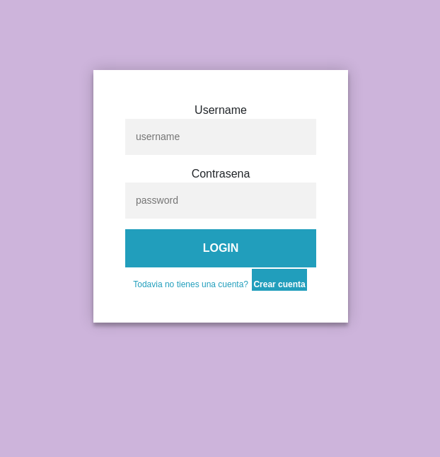
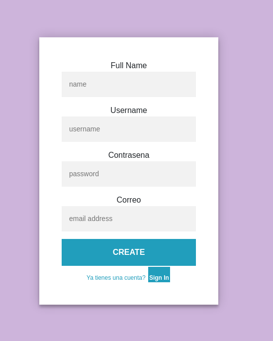
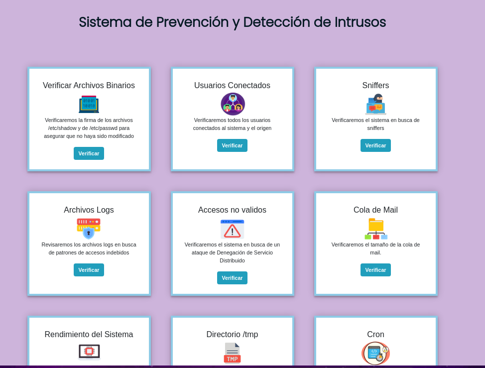

# Sistema de Detección y Prevención de Intrusos
## Acerca de este Proyecto
Este es un proyecto desarrollado para la materia Sistemas Operativos 2 de la Universidad Católica de Asunción con el propósito de aprender a defender un sistemas de posibles intrusos y todo lo que ello implica.

Los puntos cubiertos en el sistema son:

 - Verificar archivos binarios de sistema, y en particular modificaciones realizadas
a los archivo /etc/passwd y /etc/shadow.
 - Verificar los usuarios conectados al sistema y desde qué orígen.
 - Verificar si hay sniffers en el sistema:
	 - Se verifica si están en ejecucion herramientas de captura conocidas de paquetes como 'tcpdump', 'ethereal', 'wireshark'
	 - Se verifica si el sistema entró en modo promiscuo
 - Se examinan los logs del sistema en busca de patrones de accesos indebidos. Los logs examinados son:
	 - /var/log/secure
	 - /var/log/messages
	 - /var/log/httpd/access_log
	 - /var/log/maillog
 - Se verifica el tamaño de la cola de mail en busca de envíos masivos de correos desde una misma dirección
 - Se controla el rendimiento del sistema, revisando los procesos que consumen demasiada memoria y el tiempo que llevan ejecutándose. Si es mucho, se decide terminar el proceso
 - Se buscan archivos sospechosos en el directorio /tmp que podrían estar ejecutándose
 - Controlamos la presencia de Ataques Distribuidos de Denegación de Servicio (DDos)
 - Se revisan los archivos que se ejecutan con Cron
 - Se buscan intentos repetitivos de accesos indebidos
 

### Este sistema fue construido con:

 - Python
 - Bootstrap
 - Flask
 - PostgreSQL

##  Pre-requisitos

#### Del sistema:

 - Centos 9
 - Tener acceso como usuario root

#### Python3

Instalar Python3 y Pip3

    sudo yum install python3
    sudo yum install python3-pip
##### Intalación de módulos de Python

Psycopg2: necesario para trabajar con la base de datos
 

    pip3 install --user psycopg2

 Flask
 

    pip3 install --user flask
dotenv

    pip3 install --user python-dotenv

#### PostgreSQL
Instalar y configurar PostgreSQL

    sudo yum install postgresql
    sudo yum install postgresql-server
  
Creamos un nuevo cluster de la base de datos PostgreSQL

    sudo systemctl start postgresql

Iniciamos y habilitamos el servicio de postgres

    sudo systemctl start postgresql
    sudo systemctl enable postgresql
    
    
##### Ahora debemos configurar la Base de Datos
Iniciamos como usuario postgres

    sudo -i -u postgres

Creamos un nuevo rol

    create user hips with password '<BD_HIPS_PASSWD>';
Creamos una base de datos

    createdb hips
Le asgnamos los permisos necesarios al rol "hips"

    GRANT ALL PRIVILEGES ON DATABASE hips TO hips;

#### IPTables
Detenemos el servicio de firewalld

    sudo systemctl stop firewalld
Se deshabilita

    sudo systemctl disable firewalld
Maskeamos para evitar que otro programa lo invoque

    sudo systemctl mask --now firewalld
Intalamos IPTables

    sudo yum install iptables-services -y
Iniciamos y habilitamos el servicio

    sudo systemctl start iptables
    sudo systemctl enable iptables
    sudo systemctl start ip6tables
    sudo systemctl enable ip6tables
Verificamos que esté funcionando

    sudo systemctl status iptables
    sudo systemctl status ip6tables

#### Crontab

    sudo yum install cronie

## Instalación

Descarga el programa en tu Desktop.

    git clone https://github.com/camidorego/HIPS.git
Ingresa dentro del directorio "HIPS" y establece la contraseña que elegiste para la base de datos

    cd HIPS
    nano .env
    DB_PASSWD='<contraseña>'
    
Guarda el archivo y cambia los permisos para que solo root pueda revisarlo

   

    sudo su
    chmod 700 .env

## Directorios Necesarios

Necesitamos crear algunos directorios donde el sistema guardará los resultados, las alarmas y los métodos de prevención.

Estando como usuario root

    mkdir /var/log/hips
    mkdir /var/log/hips/resultados
    mkdir /var/log/hips/resultados/accesos
    mkdir /var/log/hips/resultados/controlar_logs
    mkdir /var/log/hips/resultados/cron
    mkdir /var/log/hips/resultados/ddoc
    mkdir /var/log/hips/resultados/procesos
    mkdir /var/log/hips/resultados/sniffer
    mkdir /var/log/hips/resultados/tmp
    mkdir /var/log/hips/resultados/usuarios_conectados
    mkdir /var/log/hips/resultados/ver_cola_mail
    mkdir /var/log/hips/resultados/verificar_firma

Crear los logs

    touch mkdir /var/log/hips/alarmas.log

    touch /var/log/hips/prevencion.log
    
## Modo de Uso
Estando como root y en la carpeta HIPS

     export FLASK_APP=app
     flask run

En el navegador abre el siguiente link
   

    http://127.0.0.1:5000

Te aparecerá la página para loggearte

  

Puedes crear una cuenta haciendo click en el botón de 'Crear Cuenta' y te llevará a la página para que puedas registrarte

  

Una vez que completaste tu información se te llevará nuevamente a la página para que puedas loggearte con el username y contraseña que recién creaste

Luego te aparecerá el menu. Elige lo que quieres controlar y listo!

  <a href="">
    

## Información del Programador
           

Camila Do Rego Barros

Correo: camiladoregobarros@gmail.com
